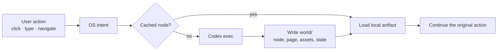

<div align="center">


# VibeOS

### A desktop that grows into whatever you open. ✨

**A browser-hosted operating system where missing software is prepared on demand by Codex — then behaves like software that was always there.**

[](LICENSE) [](https://nodejs.org/)

</div>

<p align="center"></p>

> **The idea:** the browser is not watching an agent write a demo. It is using a real OS. A slow first open is simply a page taking time to load; once prepared, that page is durable local software.

## 🖼️ See the shape of it

<table><tr><td width="50%"><br><sub><b>🔎 Launcher</b> — installed apps and generated destinations live together.</sub></td><td width="50%"><br><sub><b>🎨 Appearance</b> — system-wide theme and desktop controls.</sub></td></tr><tr><td width="50%"><br><sub><b>🌐 Browser</b> — locally imagined pages, opened through normal OS navigation.</sub></td><td width="50%"><br><sub><b>🌱 One core, an open-ended world</b> — windows branch into new places.</sub></td></tr></table>

## 🌌 What is VibeOS?

VibeOS is an experiment in **lazy, generative computing**. You can install an app that has never existed, enter a website without connecting to the real Internet, or explore a child page nobody designed beforehand. Codex fills in the missing node locally and hands control back to the desktop.

From the browser’s point of view, this is a normal OS:

- 🪟 movable, resizable, focusable, minimizable, maximizable windows
- 🚀 a launcher, dock, settings, browser, app shop, files, and Assistant
- 💾 durable generated pages and assets under the tracked `world/` tree
- 🌳 recursive worlds — an app can own pages, apps, or another complete environment
- 🌓 system light/dark themes that generated pages can follow

The core stays generic; each generated node decides what it means, what its direct children are, how it behaves, and how it stores state.

## 🧭 How it works



```text
Browser UI → WebSocket runtime → Codex exec subprocess → world/ artifact tree
```

The browser sends normal OS intents. The runtime manages windows, focus, navigation, persistence, loading, and cache hits. When a route or app page is missing, the server invokes `codex exec` with the exact target, parent context, settings, acceptance criteria, and local world files. Codex writes the result into the target subtree and returns a ready marker. The runtime reloads the artifact and continues the original user action.

Generated pages are self-contained HTML/CSS/JavaScript when rich behavior is needed. They must implement the current page completely, use semantic theme tokens, support light and dark system themes, avoid accidental overflow, and keep meaningful state persistent within their node.

Generated work is ordinary project state, not an opaque database. It can be inspected, tested, committed, reviewed, and reused on the next `npm run dev`. The first load may take time; subsequent loads should use the existing node and its internal cache.

## 🎯 Why build this?

- 🧪 Prototype a product idea by using it before building the whole product.
- 🎮 Ask for a game, then let its screens and interactions grow as you explore.
- 📝 Create a persistent personal tool such as Notes, a planner, or a studio.
- 🌐 Visit a locally authored version of an arbitrary destination.
- 🖥️ Model nested environments, virtual machines, or software worlds.
- 🛠️ Report a broken interaction to Assistant and let the affected node be repaired.

## ⚡ Quick start

### Requirements

- Node.js 20+
- npm
- A working `codex` CLI available on `PATH`
- Permission for the local Codex process to edit this workspace

### Launch

```bash
npm install
npm run build
npm run dev
```

Open the web URL printed by Vite. The backend listens on `ws://localhost:8787` and exposes `/health`. Frontend and backend logs are written to the terminal; generated artifacts live under `world/apps/`.

## 🧰 Debugging

Start with the terminal output and `dev.log` if present. The server tags runtime events and Codex stdout/stderr so a failed page can be traced from the original intent to the generated artifact. Useful checks:

```bash
npm test
npm run build
npm run e2e --workspace @vibeos/web
git diff --check
```

The Assistant app can receive a natural-language problem report from inside the OS. For a reproducible issue, include the app, route, action, expected result, actual result, and approximate time; the runtime already supplies recent operations and logs to the repair task.

## 🤝 Contributing

Keep the core generic. App-specific meaning belongs in the `world/` tree, not in `if appId === ...` branches in the runtime. Generated applications should be committed with their node manifests, assets, entrypoints, and tests where practical. Changes should include focused regression coverage and pass the commands above.

Please keep pull requests self-contained with a concise problem statement, design notes, verification commands/results, screenshots for visual changes, and generated world artifacts when relevant.

The maintainer is busy and may not reply frequently. Make reasonable decisions, document assumptions, and leave a runnable result rather than waiting for conversational approval. 📨

## Project map

- `apps/server` — WebSocket runtime, persistence, world loading, and direct Codex subprocess adapter
- `apps/web` — desktop UI and Playwright tests
- `packages/shared` — shared runtime and world contracts
- `world` — durable generated application tree and cache
- `docs/vibeos-design.md` — architecture and product design

## License

VibeOS is free software licensed under the [GNU Affero General Public License v3.0 or later](LICENSE).
